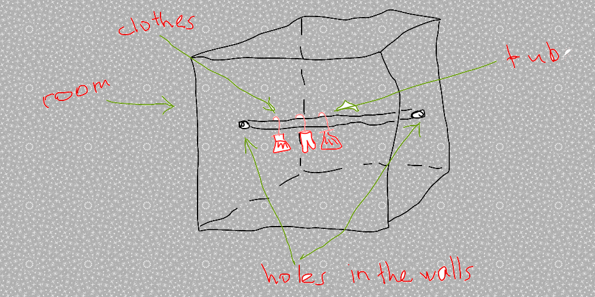

###9. Now you have so many clothes, you definitely need to put it somewhere! Your friend which works on metal cutting factory says that he can bend a metallic plate in such a way that it forms a cylindric tube so you can put it in your room to hang all your new clothes just like this:

Your room width is 2m, you've made the holes in the walls of 5cm in diameter. What is the area of the metallic plate that need to be cut in order to bend it into the needed cylindrical tube?

<small>Hint: Calculate the perimeter of the circumferences of the holes. Now you just need to calculate the area!</small>

---

#### Your Answer

>

>

>

>

>

>

>

>

---

    Answer: 2.5*3.14*2 = 31.4m²

<button class="show-answers">Show Answers!</button>