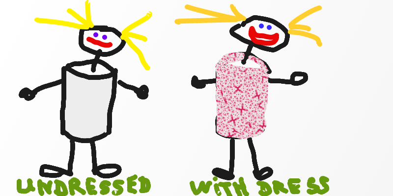

#####10. Let's pretend that Taissa's body has exactly cylindrical form. And that all the dresses she bought at Primark has also this form.
Just like this:

You know that 2/3 of your body is water. Let's imagine that in case of Taissa all this water is concentrated in the cylindrical part of body.
Once she tried to realize the capacity of her body and drank exactly 38.01327L of water! 
Given that Taissa's height is 1m50cm please calculate the total surface area of 5 new Taissa's dresses!
Give the answer in cm² and in m² and round it to two decimal points.

<small>Hint: First you need to calculate the cylinder's radius. You can do it, knowing the volume and height (do not forget about the same units, use cm).
 Also do not forget that the height of cylinder is 2/3 of total Taissa's height. 
 Also to make the calculations easier, when you get your intermediate radius², round it to the integer.
 Knowing the radius, you can easily calculate the surface area =)
</small>

---

** Your Answer **

<textarea style="border:none;" rows="10" cols="100"></textarea>
---

    Answer: 
    
    A = 2πrh
    
    (2 * Math.PI * Math.sqrt(38013.27/(2/3*150)/Math.PI) * (2/3*150)) * 5 = 6911.5 * 5 = 34557.5cm² (3.46m²)

<button class="show-answers">Show Answers!</button>