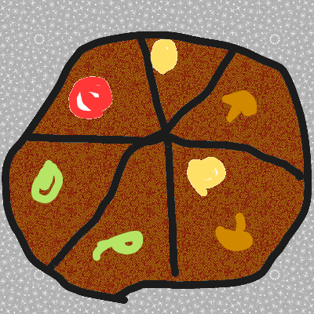

#####11. After the shopping here comes pizza time! Taissa's oven's depth is 60cm. What's the maximum area of pizza that Taissa can buy? Please give an answer in m² and round to two decimal places.

<small>Hint: Think about pizza's radius!</small>

---

** Your Answer **

<textarea style="border:none;" rows="5" cols="100"></textarea>
---


Please write a javascript expression to calculate the pizza's area.

var x =

var x = Math.PI * Math.pow(0.3, 2);

assert(x == Math.PI * Math.pow(0.3, 2));



    Answer: 0.3²*3.14 = 0.28m²

#####11.1 And if there was no oven and you could only use microwave which diameter is of 30cm?

** Your Answer **

<textarea style="border:none;" rows="5" cols="100"></textarea>
---

    Answer: 0.15²*3.14 = 0.07m²

#####11.2 How many times the area of the oven's pizza is bigger than the area of the microwave's pizza? And how many times the first diameter is bigger than the second?
Why does this happen?

** Your Answer **

<textarea style="border:none;" rows="5" cols="100"></textarea>
---

<button class="show-answers">Show Answers!</button>