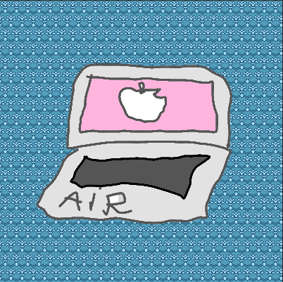

#####7. Now let's get back to your 2L bottle of 2-euros coins which gives us 1740 euros. With this amount you decide to go shopping! First of all you go to Saturn at Alexanderplatz, and what do you see? Your favourite MacBook Air with 35% of discount! Now it costs **just** 1365 euros. You decide to buy it. If there was no discount, would you still be able to buy it with your money? Why?

<small>Hint: Calculate the amount without discount and compare it with 2000.</small>

---

** Your Answer **

<textarea style="border:none;" rows="10" cols="50"></textarea>
---

    Answer: No, you wouldn't able to buy this nice MacBookAir. Because it would cost 2100 euros.

<button class="show-answers">Show Answers!</button>