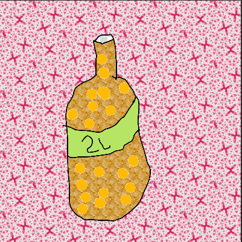

#####4. In the previous section we realized that we've need **870** 2-euros coins to fill in 1L bottle. Now imagine that you have 2L bottle full of 2 euro coins. How much money do you have?

---

** Your Answer **

<textarea style="border:none;" rows="10" cols="100"></textarea>
---

    Answer: 1740 euros

#####5. If your purpose was to have 10 in the power of 3 of two euro coins, how many coins would you need more to obtain that amount?

<small>Hint: First think about how many is 2 euro coins multiplied by 10 in power of 3, than subtract. Do not forget that we want to know the number of 2-euro coins and not just the amount of needed money.</small>

---

** Your Answer **

<textarea style="border:none;" rows="10" cols="100"></textarea>
---

    Answer: 130 2 euro coins

#####6. Someone gave to you the 150ml glass full of 2-euro coins (remember, the shape doesn't matter for us). Do you think this amount is enough for you to obtain what you want in the previous question?

<small>Hint: Look in the previous sections what is the volume of one 2-euro coin. Make a necessary division to understand how many coins are there in the glass. Do not forget to round to the integer number.</small>

---

** Your Answer **

<textarea style="border:none;" rows="10" cols="100"></textarea>
---

    Answer: Yes, this amount is exactly what we need (150/1.15 ~130). And we need exactly 130 two-euros coins to make from 1740 euros to 2000.

<button class="show-answers">Show Answers!</button>